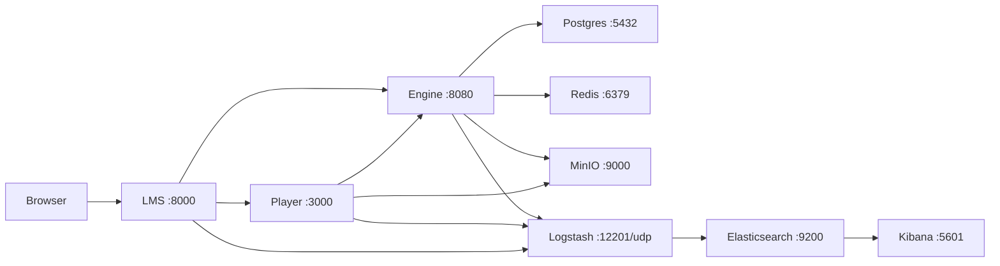
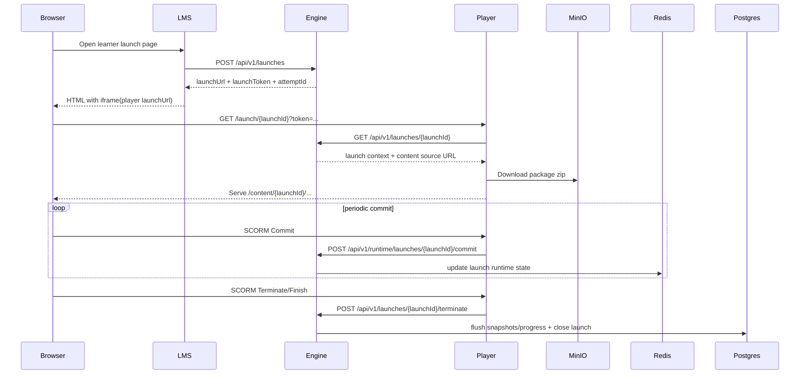

# central-docker-infrastructure

## Scope
Docker Compose orchestration for the SCORM platform:
- `engine` (Spring Boot)
- `player` (Node.js/TypeScript)
- `lms` (Laravel example client)
- `postgres`, `redis`, `minio`, `elasticsearch`, `logstash`, `kibana`

## Runtime
- Compose file: `infrastructure/docker-compose.yml`
- Shared network: `scorm-network`

## Host Ports
| Component | Host Port | Container Port | Notes |
| --- | --- | --- | --- |
| LMS | `8000` | `8000` | Laravel app UI/API |
| Player | `3000` | `3000` | Launch page + SCO content + internal runtime endpoints |
| Engine | `8080` | `8080` | SCORM engine REST API |
| Postgres | `5432` | `5432` | Engine relational persistence |
| Redis | `6379` | `6379` | Runtime launch state |
| MinIO API | `9000` | `9000` | Object storage |
| MinIO Console | `9001` | `9001` | MinIO admin UI |
| Elasticsearch | `9200` | `9200` | Log indexing |
| Logstash (GELF UDP) | `12201/udp` | `12201/udp` | Container log ingestion |
| Kibana | `5601` | `5601` | Log UI |

## Architecture


## Request Flow (Launch + Runtime)


## Start
```bash
cd infrastructure
cp .env.example .env
docker compose up --build
```

## Validation
```bash
cd infrastructure
bash scripts/validate-env.sh .
bash scripts/smoke-check.sh
```
